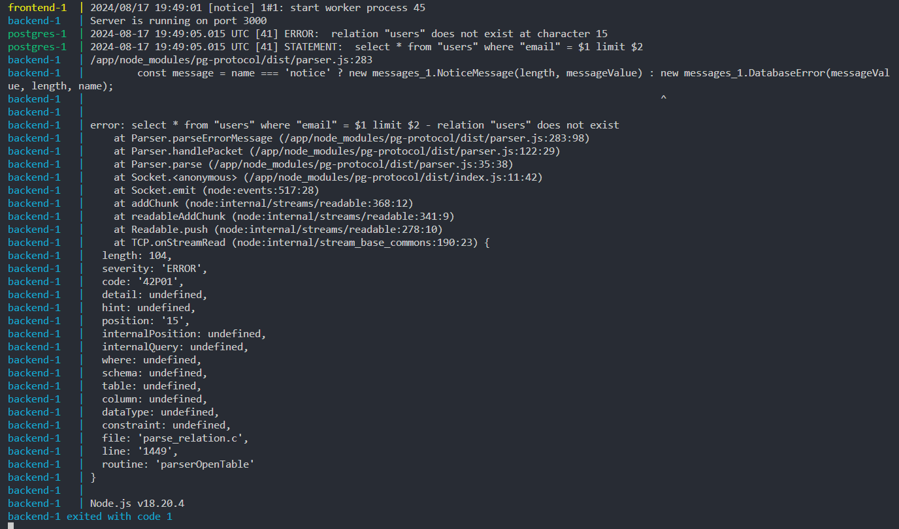

# Portfolio

# Demo

[Video Demo](https://www.youtube.com/watch?v=OYBps-MYzzY&ab_channel=JarnoPauwels)

# Installation

Clone the project

```
git clone https://github.com/EHB-MCT/portfolio-tweede-zit-v2-JarnoPauwels.git
```

Install packages for the backend and frontend

```
cd backend
npm install

cd ..
cd frontend
npm install
```

Create .env file with credentials to PostgreSQL in both the root folder and the backend folder

```
POSTGRES_HOST=
POSTGRES_USER=
POSTGRES_PASSWORD=
POSTGRES_DB=
POSTGRES_PORT=
```

Start Docker containers in the root folder

```
docker-compose up --build
```

> [!NOTE]
> To start the backend go to the terminal and navigate to the backend folder. See [Error Section](#error) for more info.

```
cd backend
npm run dev
```

# Error

The postgres and backend container in the docker compose are commented out because of the following error so the backend has to be manually started in the terminal.



# References

- [ChatGPT Log](https://chatgpt.com/share/554b7934-c08a-4219-a073-f240294fbf95)
- [Knex](https://knexjs.org/guide/)
- [How to Use Docker Compose to Build and Run a Node.js and React Web Application](https://javascript.plainenglish.io/how-to-use-docker-compose-to-build-and-run-a-node-js-and-react-web-application-97db324bc606)
- [Mastering PostgreSQL with Docker: A Step-by-Step Tutorial](https://medium.com/@okpo65/mastering-postgresql-with-docker-a-step-by-step-tutorial-caef03ab6ae9)
- [Docker Compose](https://docs.docker.com/compose/gettingstarted/)
- [MUI](https://mui.com/material-ui/getting-started/)
- [MUI Theme](https://mui.com/material-ui/customization/dark-mode/)
- [How to Add Dark Mode in ReactJS Using Material UI](https://semaphoreci.com/blog/dark-mode-reactjs-material-ui)
- [MUI Grid](https://blog.logrocket.com/guide-mui-grid-system/)
